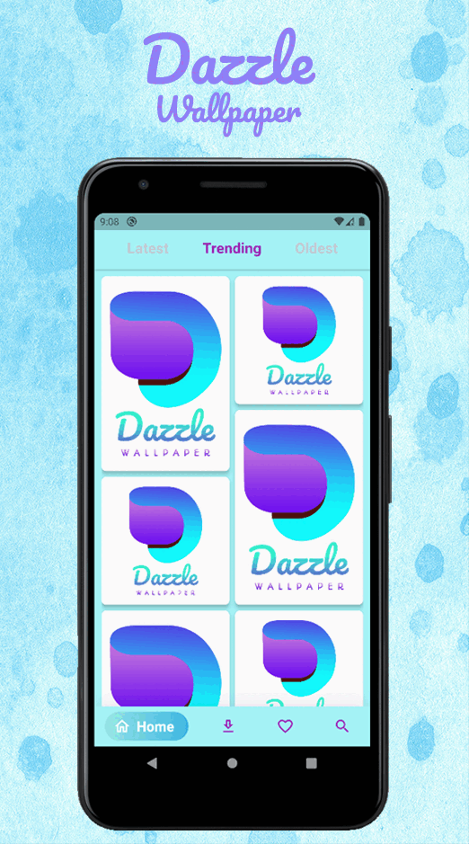

&nbsp;&nbsp;
&nbsp;&nbsp;
<a href="https://choosealicense.com/licenses/mit/" target="_blank"></a>&nbsp;&nbsp;


# Dazzle Wallpaper

</img>

<p align="justify" >
Dazzle Wallpaper is a mobile application. Here, you will find the awesome wallpapers for your phone and tablet all of the wallpapers high quality photos.
</p>
<p align="justify">
  
<b>Powered by Unsplash:</b> The largest open collection of high-quality images.

Enjoy a new wallpaper every day! from the best source of photography: unsplash.com

## Features:

◉ Surf by latest, trending, or categories<br>
◉ Daily updated photos<br>
◉ More than 1.1M free photos<br>
◉ Full screen Wallpapers<br>
◉ Search images<br>
◉ Easy to use, and a comfortable user experience<br>
◉ Add the wallpapers you like to the "Favorite Section" in order to see them whenever you like<br>
◉ Download wallpapers to check them offline<br>
◉ Fast loading<br>
</p>

Note: It's an open-source project; hence anyone can use this code according to the [MIT License](https://choosealicense.com/licenses/mit/) rules & regulations.

## Packages used:


// For using Home Screen, Lock Screen and Both Screen mode<br>
[flutter_wallpaper_manager: ^0.0.3](https://pub.dev/packages/flutter_wallpaper_manager)<br>
// For custom grid view<br>
[flutter_staggered_grid_view: ^0.6.1](https://pub.dev/packages/flutter_staggered_grid_view)<br>
// For displaying google Ads<br>
[google_mobile_ads: ^1.2.0](https://pub.dev/packages/google_mobile_ads)<br>
// For sharing image to other devices<br>
[share_plus: ^4.0.4](https://pub.dev/packages/share_plus)<br>
// For using Bottom Navigation bar<br>
[google_nav_bar: ^5.0.6](https://pub.dev/packages?q=google_nav_bar)<br>
// For using cashing wallpaper data<br>
[hive_flutter: ^1.1.0](https://pub.dev/packages/hive_flutter)<br>
// For custom loading indicator<br>
[loading_indicator: ^3.0.3](https://pub.dev/packages/loading_indicator)<br>
// For State management<br>
[get: ^4.6.1](https://pub.dev/packages/get)<br>
// For internet connectivity<br>
[connectivity_plus: ^2.3.0](https://pub.dev/packages/connectivity_plus)
// For making http requests<br>
[http: ^0.13.4](https://pub.dev/packages/http)<br>

</img>

<br>
<br>
<br>
<br>
<br>

# Installation

◉ Open your workspace folder in 'Command Prompt' or 'Terminal'
◉ Copy & paste this command:

```
$ git clone https://github.com/AshiqNoor/dazzle.git
```

◉ Open the 'dazzle' folder using your Android Studio or VSCode.
◉ Use this commands in your Android Studio / VSCode terminal:

```
$ flutter pub get
$ flutter run
```


Note: To run this application on your system, you will need [git](https://git-scm.com/) and [flutter](https://docs.flutter.dev/get-started/install) environment already installed.